# IFF Project

To achieve the proposed objective, I implemented a solution using the **Medallion Architecture**, processing nine sets of synthetic data representing various business entities such as customers, suppliers, revenues, and more. The system was designed to ingest, transform, and model this data across three distinct tiers—**Bronze**, **Silver**, and **Gold**—using modern, open-source tools. Below, we detail how this was accomplished with **Terraform**, **Airflow**, **Docker**, and **DuckDB**.

---

## Docker

**Docker** was essential for creating the virtual infrastructure. The project was developed on a macOS environment and virtualized on Linux using containers. This approach ensured:

- **Consistency** across different platforms
- **Portability** for easy deployment
- **Reproducibility** of the setup

---

## Terraform

**Terraform** was utilized as an infrastructure-as-code tool to provision the AWS S3 environment. This step is optional if you already have a test bucket. If not, you can:

1. Use a generic AWS account with access keys
2. Follow the accompanying documentation to create a test bucket

---

## Airflow

**Airflow** orchestrated workflows between the data lake and the analytical database, with all orchestration coded in Python. Key points include:

- Minimized pipelines for streamlined unit testing of ingestion and processing
- Recommendation: Subdivide pipelines further in larger-scale implementations for better **modularity** and **maintainability**

---

## DuckDB

**DuckDB** acted as the analytical database, managing the data warehouse processing layers:

- **Bronze Tier**: Handled data ingestion
- **Silver Tier**: Facilitated efficient data transformation
- **Gold Tier**: Enabled optimized data modeling

This setup ensured a robust and efficient data pipeline.

---


### Prerequisites

- Docker version 27.4.0, build bde2b89
- Python 3.12.9
- Dbeaver 24.1.4.202408041450 (Optional)
- Airflow 2.10.5
- Terraform 1.10.5
- External dependencies, if any.

### Initial Steps

Follow these instructions to install the project locally:

1. Clone the repository:
   ```bash
   cd <your path here>
   git clone https://github.com/BuenoSintax/iff.git
   ```

For me, my local now is Users/mauriciobueno/iff
   

### Initial Steps for env

This step is for create a virtual environment with Docker. You can create image from docker file:

1. On your folder cloned, you will create a build of docker file:
   
   ```bash
   cd <your path here>/iff
   docker build -t infra_iff .

2. You need an AWS security credential to store the csv files. Access your ```AWS console``` and search for ```IAM > Access keys```
   Save ```AWS_ACCESS_KEY_ID```, ```AWS_SECRET_ACCESS_KEY```, be it what you created now or what you already have.
   
3. After that you need to run a docker container. Make sure docker is running. This is an important step because this is where the AWS environment variables will be passed. 
   It needs to be in this folder because a docker volume will be created so that it is also possible to work with local files.

   Below you can see that some changes need to be made.

   Ensure that ```-v /Users/mauriciobueno/iff:/home/infra``` is your cloned folder, i.e. ```-v 'YourPathHere'/iff:/home/infra```
   Here you will define the name of your AWS bucket. It needs to be globally ```unique```, in my case I chose ifftest1. If you don't have it, choose it anyway, because more
   below I'll show you how to do it with Terraform.
    
   ```bash
   docker run -d --name infra_iff -p 8080:8080 \
     -v <your path here>/iff:/home/infra \
     -e AWS_ACCESS_KEY_ID=<your access key here> \
     -e AWS_SECRET_ACCESS_KEY=<your secret key here> \
     -e AWS_DEFAULT_REGION=sa-east-1 \
     -e AIRFLOW__CORE__DAG_DIR_LIST_INTERVAL=30 \
     -e AIRFLOW__CORE__LOAD_EXAMPLES=False \
     -e BUCKET_NAME=<your bucket with unique name> \
     infra_iff
   ```


## Use
After that, the container should be running and the folder should have the following characteristics.


   1 - With the local terminal in the /iff folder, you now need to access the container terminal.

   ```bash   
       docker exec -it infra_iff bash
   ```


From now on, the development environment is already working, if the bucket already exists! 🎉🎉 

---
### Creating bucket

⚠️ If the bucket does not exist on AWS, follow the procedure below to create it via Terraform. ⚠️

Access the ```/iff``` folder and then modify the file main.ts and save. Define the name of your new bucket to be created, ensuring that it is unique in AWS. 


⚠️ This name must be the same defined above ```-e BUCKET_NAME=<your bucket with unique name>```  
      


   
   2- Execute one at a time with terminal container 

   
   ```bash
   terraform init
   terraform plan
   terraform apply
   ```

Now you can see that the bucket was created successfully.


Now everything is configured and airflow is already running locally at http://localhost:8080
Your airflow credentials is:
u: admin
p: admin


---
### On airflow
After airflow is loaded, it is necessary to send the dags to the airflow/dags folder, so that the pipeline is active.


It should have the following characteristics now:


As soon as you move the dags, after 30 seconds at http://localhost:8080 and reloading the page, the airflow must be like this


---
### Executing airflow

To start the loading process, it is first necessary to execute the load, where it is checked which files are needed, where they come from and where they will go. 
In this case, the ```.zip``` of the project is downloaded and then sent to the ```s3 bucket```

By pressing the execute button, the trigger is activated and then the analytical database is created and all checks are carried out in addition to validations on tables and data.


```log
b914c70d278c
▶ Log message source details
[2025-02-28, 19:10:22 UTC] {local_task_job_runner.py:123} ▶ Pre task execution logs
[2025-02-28, 19:10:23 UTC] {logging_mixin.py:190} INFO - Table dp_rawmaterialtype_staging created successfully.
[2025-02-28, 19:10:23 UTC] {logging_mixin.py:190} INFO - Table dp_customers_staging created successfully.
[2025-02-28, 19:10:23 UTC] {logging_mixin.py:190} INFO - Table dp_stocks_staging created successfully.
[2025-02-28, 19:10:23 UTC] {logging_mixin.py:190} INFO - Table dp_ingredientsrawmaterial_staging created successfully.
[2025-02-28, 19:10:23 UTC] {logging_mixin.py:190} INFO - Table dp_salestransactions_staging created successfully.
[2025-02-28, 19:10:23 UTC] {logging_mixin.py:190} INFO - Table dp_provider_staging created successfully.
[2025-02-28, 19:10:23 UTC] {logging_mixin.py:190} INFO - Table dp_recipes_staging created successfully.
[2025-02-28, 19:10:23 UTC] {logging_mixin.py:190} INFO - Table dp_ingredients_staging created successfully.
[2025-02-28, 19:10:23 UTC] {logging_mixin.py:190} INFO - Table dp_flavours_staging created successfully.
[2025-02-28, 19:10:23 UTC] {python.py:240} INFO - Done. Returned value was: None
[2025-02-28, 19:10:23 UTC] {taskinstance.py:341} ▶ Post task execution logs
```


```log
[2025-02-28, 19:10:05 UTC] {local_task_job_runner.py:123} ▶ Pre-task Execution Logs
[2025-02-28, 19:10:06 UTC] {subprocess.py:78} INFO - Tmp directory root location: /tmp
[2025-02-28, 19:10:06 UTC] {subprocess.py:88} INFO - Command running: ['/usr/bin/bash', '-c', 'python /home/infra/prompts/integrate.py 2>&1']
[2025-02-28, 19:10:06 UTC] {subprocess.py:99} INFO - Output:
[2025-02-28, 19:10:06 UTC] {subprocess.py:106} INFO - INFO:root:Starting download of file: https://storage.googleapis.com/playoffs/iff/data_engineering.zip
[2025-02-28, 19:10:08 UTC] {subprocess.py:106} INFO - INFO:root:File downloaded and saved to: /tmp/landing/data_engineering.zip
[2025-02-28, 19:10:09 UTC] {subprocess.py:106} INFO - INFO:root:Content extracted to: /tmp/landing/extracted
[2025-02-28, 19:10:09 UTC] {subprocess.py:106} INFO - INFO:root:ZIP file successfully removed.
[2025-02-28, 19:10:10 UTC] {subprocess.py:106} INFO - INFO:root:Sending /tmp/landing/extracted/data/data_engineering/20250121/SalesTransactions_20240505_1.csv to s3://ifftest1/landing/20250121/SalesTransactions_20240505_1.csv
[2025-02-28, 19:10:10 UTC] {subprocess.py:106} INFO - INFO:root:Sending /tmp/landing/extracted/data/data_engineering/20250121/Flavours_20240505_1.csv to s3://ifftest1/landing/20250121/Flavours_20240505_1.csv
[2025-02-28, 19:10:10 UTC] {subprocess.py:106} INFO - INFO:root:Uploading /tmp/landing/extracted/data/data_engineering/20250121/RawMaterialType_20240505_1.csv to s3://ifftest1/landing/20250121/RawMaterialType_20240505_1.csv
[2025-02-28, 19:10:10 UTC] {subprocess.py:106} INFO - INFO:root:Uploading /tmp/landing/extracted/data/data_engineering/20250121/Provider_20240505_2.csv to s3://ifftest1/landing/20250121/Provider_20240505_2.csv
[2025-02-28, 19:10:10 UTC] {subprocess.py:106} INFO - INFO:root:Sending /tmp/landing/extracted/data/data_engineering/20250121/Provider_20240505_1.csv to s3://ifftest1/landing/20250121/Provider_20240505_1.csv
[02/28/2025, 19:10:10 UTC] {subprocess.py:106} INFO - INFO:root:Sending /tmp/landing/extracted/data/data_engineering/20250121/SalesTransactions_20240505_2.csv to s3://ifftest1/landing/20250121/SalesTransactions_20240505_2.csv
[2025-02-28, 19:10:10 UTC] {subprocess.py:106} INFO - INFO:root:Sending /tmp/landing/extracted/data/data_engineering/20250121/IngredientsRawMaterial_20240505.csv to s3://ifftest1/landing/20250121/IngredientsRawMaterial_20240505.csv
[2025-02-28, 19:10:11 UTC] {subprocess.py:106} INFO - INFO:root:Uploading /tmp/landing/extracted/data/data_engineering/20250122/Provider_20240506_1.csv to s3://ifftest1/landing/20250122/Provider_20240506_1.csv
[2025-02-28, 19:10:11 UTC] {subprocess.py:106} INFO - INFO:root:Uploading /tmp/landing/extracted/data/data_engineering/20250122/Recipes_20240507_3.csv to s3://ifftest1/landing/20250122/Recipes_20240507_3.csv
[2025-02-28, 19:10:11 UTC] {subprocess.py:106} INFO - INFO:root:Uploading /tmp/landing/extracted/data/data_engineering/20250122/Recipes_20240510_1.csv to s3://ifftest1/landing/20250122/Recipes_20240510_1.csv
[02/28/2025, 19:10:11 UTC] {subprocess.py:106} INFO - INFO:root:Sending /tmp/landing/extracted/data/data_engineering/20250122/Recipes_20240507_1.csv to s3://ifftest1/landing/20250122/Recipes_20240507_1.csv
[2025-02-28, 19:10:11 UTC] {subprocess.py:106} INFO - INFO:root:Sending /tmp/landing/extracted/data/data_engineering/20250122/SalesTransactions_20240506_2.csv to s3://ifftest1/landing/20250122/SalesTransactions_20240506_2.csv
[2025-02-28, 19:10:11 UTC] {subprocess.py:106} INFO - INFO:root:Sending /tmp/landing/extracted/data/data_engineering/20250122/Recipes_20240510_2.csv to s3://ifftest1/landing/20250122/Recipes_20240510_2.csv
[2025-02-28, 19:10:12 UTC] {subprocess.py:106} INFO - INFO:root:Sending /tmp/landing/extracted/data/data_engineering/20250122/Ingredients_20240506_1.csv to s3://ifftest1/landing/20250122/Ingredients_20240506_1.csv
[2025-02-28, 19:10:12 UTC] {subprocess.py:106} INFO - INFO:root:Sending /tmp/landing/extracted/data/data_engineering/20250122/Recipes_20240507_2.csv to s3://ifftest1/landing/20250122/Recipes_20240507_2.csv
[2025-02-28, 19:10:12 UTC] {subprocess.py:106} INFO - INFO:root:Sending /tmp/landing/extracted/data/data_engineering/20250122/SalesTransactions_20240506_1.csv to s3://ifftest1/landing/20250122/SalesTransactions_20240506_1.csv
[2025-02-28, 19:10:12 UTC] {subprocess.py:106} INFO - INFO:root:Sending /tmp/landing/extracted/data/data_engineering/20250125/Stocks_20240505_1.csv to s3://ifftest1/landing/20250125/Stocks_20240505_1.csv
[02/28/2025, 19:10:12 UTC] {subprocess.py:106} INFO - INFO:root:Sending /tmp/landing/extracted/data/data_engineering/20250124/Customers_20240508_1.csv to s3://ifftest1/landing/20250124/Customers_20240508_1.csv
[2025-02-28, 19:10:12 UTC] {subprocess.py:106} INFO - INFO:root:Sending /tmp/landing/extracted/data/data_engineering/20250123/Ingredients_20240507_1.csv to
```

After that, you can check in your iff directory the creation of the file ```iff_db.duckdb``` where the analytical database is located. 
In my case with dbeaver, I accessed this database by selecting this file.


It is now possible to run the silver layers for each table. There, transactional control is guaranteed.


You can see in dbeaver now that the silver tables with validity and if they are active are listed with the guaranteed control SCD 2, exception of salestransaction. 
Both the insertion values ​​in ```load_timestamp``` and the file source date ```source_date``` are fully configured.


Após todas as tabelas silver garantidas e com seus controles transacionais como ativos, é possivel gerar uma tabela final como essa abaixo. 
It is a simple analysis between recipe, unit flavor costs, total cost with all ingredients and profit.


```log
b914c70d278c
 ▶ Log message source details
[2025-02-28, 19:29:57 UTC] {local_task_job_runner.py:123} ▶ Pre task execution logs
[2025-02-28, 19:29:57 UTC] {dag_gold_tables.py:172} INFO - View vw_salestransaction_analytics created or replaced successfully.
[2025-02-28, 19:29:57 UTC] {python.py:240} INFO - Done. Returned value was: None
[2025-02-28, 19:29:57 UTC] {taskinstance.py:341} ▶ Post task execution logs
```
```log
b914c70d278c
 ▶ Log message source details
[2025-02-28, 19:30:01 UTC] {local_task_job_runner.py:123} ▶ Pre task execution logs
[2025-02-28, 19:30:02 UTC] {dag_gold_tables.py:191} INFO - Total records in vw_salestransaction_analytics view: 50000
[2025-02-28, 19:30:02 UTC] {dag_gold_tables.py:199} INFO - No records with null transaction_id in the view.
[2025-02-28, 19:30:02 UTC] {dag_gold_tables.py:213} INFO - No duplicates in vw_salestransaction_analytics view.
[2025-02-28, 19:30:02 UTC] {dag_gold_tables.py:215} INFO - Quality check of view (GOLD layer) completed.
[2025-02-28, 19:30:02 UTC] {python.py:240} INFO - Done. Returned value was: None
[2025-02-28, 19:30:02 UTC] {taskinstance.py:341} ▶ Post task execution logs
```


## Tables overview

### Class Overview

Below is a brief overview of each class about the project.

### **dp_salestransactions_silver**
- **Purpose**: Represents sales transactions.
- **Key Fields**:
  - **transaction_id** (PK): Unique identifier of the transaction.
  - **customer_id** (FK): Links to the customer who made the purchase.
  - **flavour_id** (FK): References the flavor involved in the transaction.
  - **quantity_liters**: Amount of product in liters.
  - **transaction_date**: Date when the transaction occurred.
  - **country**, **town**, **postal_code**: Geographic details.
  - **amount_dollar**: Transaction amount in US dollars.
  - **load_timestamp**, **source_date**: Metadata for data loading and lineage.

--

### **dp_customers_silver**
- **Purpose**: Contains customer data.
- **Key Fields**:
  - **customer_id** (PK): Unique identifier of the customer.
  - **name**, **city**, **country**: Core customer details.
  - **valid_from**, **valid_to**, **active**: Tracks the lifecycle and status of the customer record.
  - **load_timestamp**, **source_date**: Data processing timestamps.

--

### **dp_flavours_silver**
- **Purpose**: Holds information about flavors.
- **Key Fields**:
  - **flavour_id** (PK): Unique identifier of the flavor.
  - **name**, **description**: Flavor name and details.
  - **valid_from**, **valid_to**, **active**: Controls the lifecycle of the flavor record.
  - **load_timestamp**, **source_date**: Data audit timestamps.

--

### **dp_recipes_silver**
- **Purpose**: Defines recipe compositions.
- **Key Fields**:
  - **recipe_id** (PK): Unique identifier of the recipe.
  - **flavour_id** (FK): Links to the associated flavor.
  - **ingredient_id** (FK): Links to the required ingredient.
  - **quantity_grams**: Amount of ingredient in grams.
  - **heat_process**: Describes any specific heat treatment in the recipe.
  - **valid_from**, **valid_to**, **active**: Manages recipe versioning and availability.
  - **load_timestamp**, **source_date**: Data lineage timestamps.

--

### **dp_ingredients_silver**
- **Purpose**: Stores ingredient details.
- **Key Fields**:
  - **ingredient_id** (PK): Unique identifier of the ingredient.
  - **name**, **chemical_formula**, **molecular_weight**: Main properties.
  - **cost_per_gram**: Pricing attribute.
  - **provider_id** (FK): References the supplier (provider).
  - **valid_from**, **valid_to**, **active**: Lifecycle management of the ingredient.
  - **load_timestamp**, **source_date**: Timestamps for data updating.

--

### **dp_provider_silver**
- **Purpose**: Contains provider (supplier) information.
- **Key Fields**:
  - **provider_id** (PK): Unique identifier of the provider.
  - **name**, **city**, **country**: Basic provider details.
  - **valid_from**, **valid_to**, **active**: Lifecycle fields to track provider status.
  - **load_timestamp**, **source_date**: Audit timestamps.

--

### **dp_ingredientsrawmaterial_silver**
- **Purpose**: Maps ingredients to their raw material types.
- **Key Fields**:
  - **ingredient_rawmaterial_id** (PK): Unique identifier of the mapping record.
  - **ingredient_id** (FK): References the ingredient.
  - **raw_material_type_id** (FK): References the raw material type.
  - **valid_from**, **valid_to**, **active**: Tracks the validity period for the mapping.
  - **load_timestamp**, **source_date**: Audit timestamps.

--

### **dp_rawmaterialtype_silver**
- **Purpose**: Describes categories or types of raw materials.
- **Key Fields**:
  - **raw_material_type_id** (PK): Unique identifier of the raw material type.
  - **name**: Name of the raw material category.
  - **valid_from**, **valid_to**, **active**: Controls the lifecycle of each raw material type.
  - **load_timestamp**, **source_date**: Data audit timestamps.

During the integration process, I encountered several challenges with our data logic and table formats. For instance, the ```dp_recipes_silver``` table contained extremely high values in the quantity_grams field, which initially created ambiguity about whether these quantities were intended for a single liter of production or for an entire batch. This directly affected our cost calculations, as the conversion logic had to be carefully defined—assuming that 1 gram equals 1 ml and then converting the total to liters by dividing by an appropriate factor (```e.g., 1000 when the recipe is for 1,000 liters```). Additionally, there were issues with duplicate and inconsistent records, especially in the dimensions used for joining (such as ```customers``` and ```flavours```), which could result in repeated transaction IDs in the final outputs. I addressed these problems by implementing robust aggregation and filtering in our SQL queries—using grouping and distinct clauses where necessary—and by incorporating data quality checks that validate critical fields (like ensuring no null or duplicate values in primary keys) as part of the pipeline. These measures, along with clear and modular code, ensured that our transformation logic in the GOLD layer accurately calculates the cost per liter and profit, while also maintaining the integrity and traceability of the data.


### Below a diagram class of project

```mermaid
---
title: Diagram class
---
classDiagram
    direction LR
    class dp_salestransactions_silver {
        -transaction_id : INTEGER PK
        -customer_id : INTEGER FK
        -flavour_id : INTEGER FK
        -quantity_liters : DOUBLE
        -transaction_date : DATE
        -country : VARCHAR
        -town : VARCHAR
        -postal_code : VARCHAR
        -amount_dollar : DOUBLE
        -load_timestamp : TIMESTAMP
        -source_date : DATE
    }

    class dp_customers_silver {
        -customer_id : INTEGER PK
        -name : VARCHAR
        -city : VARCHAR
        -country : VARCHAR
        -valid_from : TIMESTAMP
        -valid_to : TIMESTAMP
        -active : BOOLEAN
        -load_timestamp : TIMESTAMP
        -source_date : DATE
    }

    class dp_flavours_silver {
        -flavour_id : INTEGER PK
        -name : VARCHAR
        -description : VARCHAR
        -valid_from : TIMESTAMP
        -valid_to : TIMESTAMP
        -active : BOOLEAN
        -load_timestamp : TIMESTAMP
        -source_date : DATE
    }

    class dp_recipes_silver {
        -recipe_id : INTEGER PK
        -flavour_id : INTEGER FK
        -ingredient_id : INTEGER FK
        -quantity_grams : DOUBLE
        -heat_process : VARCHAR
        -valid_from : TIMESTAMP
        -valid_to : TIMESTAMP
        -active : BOOLEAN
        -load_timestamp : TIMESTAMP
        -source_date : DATE
    }

    class dp_ingredients_silver {
        -ingredient_id : INTEGER PK
        -name : VARCHAR
        -chemical_formula : VARCHAR
        -molecular_weight : DOUBLE
        -cost_per_gram : DOUBLE
        -provider_id : INTEGER FK
        -valid_from : TIMESTAMP
        -valid_to : TIMESTAMP
        -active : BOOLEAN
        -load_timestamp : TIMESTAMP
        -source_date : DATE
    }

    class dp_provider_silver {
        -provider_id : INTEGER PK
        -name : VARCHAR
        -city : VARCHAR
        -country : VARCHAR
        -valid_from : TIMESTAMP
        -valid_to : TIMESTAMP
        -active : BOOLEAN
        -load_timestamp : TIMESTAMP
        -source_date : DATE
    }

    class dp_ingredientsrawmaterial_silver {
        -ingredient_rawmaterial_id : INTEGER PK
        -ingredient_id : INTEGER FK
        -raw_material_type_id : INTEGER FK
        -valid_from : TIMESTAMP
        -valid_to : TIMESTAMP
        -active : BOOLEAN
        -load_timestamp : TIMESTAMP
        -source_date : DATE
    }

    class dp_rawmaterialtype_silver {
        -raw_material_type_id : INTEGER PK
        -name : VARCHAR
        -valid_from : TIMESTAMP
        -valid_to : TIMESTAMP
        -active : BOOLEAN
        -load_timestamp : TIMESTAMP
        -source_date : DATE
    }

    dp_salestransactions_silver "1" --o "1" dp_customers_silver : customer_id
    dp_salestransactions_silver "1" --o "1" dp_flavours_silver : flavour_id
    dp_flavours_silver "1" --o "*" dp_recipes_silver : flavour_id
    dp_recipes_silver "1" --o "1" dp_ingredients_silver : ingredient_id
    dp_ingredients_silver "1" --o "1" dp_provider_silver : provider_id
    dp_ingredients_silver "1" --o "*" dp_ingredientsrawmaterial_silver : ingredient_id
    dp_ingredientsrawmaterial_silver "1" --o "1" dp_rawmaterialtype_silver : raw_material_type_id
```



### How it works?

## Initial pipeline

# Business Team Overview

This **pipeline** (Airflow DAG) performs the **initial load** of CSV files (stored in an S3 bucket) into a **DuckDB** database. Its main purpose is to make data available for analysis in a reliable manner. In summary, the flow:

1. **Discovers** CSV files in the `landing/` folder in S3.
2. **Creates** staging tables in DuckDB if they do not exist.
3. **Inserts** CSV data into those tables.
4. **Checks data quality** (e.g., null fields, duplicates).
5. **Moves** processed files to the `ingested/` folder for reference.

So, whenever new files arrive in S3, this pipeline loads, validates, and archives them. As a result, the data becomes ready for deeper analysis and reporting.

---

# Technical Overview A

The DAG (`dag_initial_load`) has the following **tasks** in Airflow:

1. **`run_integrate_py` (BashOperator)**  
   - Executes the `integrate.py` Python script via a Bash command.

2. **`check_missing_tables` (PythonOperator)**  
   - Lists CSV files on S3.
   - Parses filenames (extracting table name, date, and batch) using `parse_filename`.
   - Checks which staging tables (`dp_<table>_staging`) do not yet exist in DuckDB.
   - Returns the missing table names via XCom.

3. **`create_missing_tables` (PythonOperator)**  
   - Reads the list of missing tables from XCom.
   - Creates each table in DuckDB based on the field definitions (`table_fields`).
   - Also creates a sequence for `row_id` in each table.

4. **`insert_csv_data` (PythonOperator)**  
   - Lists CSV files on S3 again.
   - For each CSV, determines which staging table to load into.
   - Uses `read_csv_auto` to insert data into DuckDB.
   - Fills fields such as `row_id`, `inserted_at`, `batch_value`, `origin_date`.

5. **`check_data_quality` (PythonOperator)**  
   - Receives from XCom the names of the tables that were loaded.
   - For each table, performs checks:
     - Total record count.
     - Nulls in critical fields.
     - Duplicates in unique fields (e.g., `transaction_id` in `salestransactions`).
   - Logs the results in `data_quality.log`.

6. **`move_files_to_ingested` (PythonOperator)**  
   - Reads from XCom the list of processed CSV files.
   - Moves each from `landing/` to `ingested/` folder in S3.
   - Ensures the `ingested/` folder exists.


### Execution Flow

# Business Team Explanation 

This pipeline implements a **Type 2 Slowly Changing Dimension (SCD)** process for the **customers** data. In simpler terms, it tracks **historical changes** in a customer's attributes (like name, city, country) over time. Each time a customer's information changes, the pipeline:

1. Closes (inactivates) the previous record in the Silver table by setting a `valid_to` date.
2. Inserts a new, active record for that customer, starting from the new change date.

As a result, I can preserve the **history** of how a customer's data changes over time. This benefits auditing and analytics: you can see **who** changed, **what** changed, and **when** it changed.

Additionally, the pipeline checks **data quality**. It logs how many records exist in the Silver table, flags any null `customer_id`, and warns if there are multiple active records for the same customer.

---

#  Technical Explanation

Below is the **Airflow DAG** code. It follows these steps:

1. **`setup_silver_table`**: Creates or checks the Silver table `dp_customers_silver`.
2. **`process_scd2_customers`**: Applies SCD Type 2 logic using a staging table `dp_customers_staging`.
   - Inserts new customers if they don't exist in Silver.
   - Identifies updated records (where name, city, or country changed).
   - Closes the old versions by setting `valid_to` and `active = FALSE`.
   - Inserts new active versions.
   - Marks them as processed in staging (`merge_status = 1`).
3. **`check_data_quality`**: Logs total records, checks for null `customer_id`, and detects duplicates where `active = TRUE`.

Finally, the DAG orchestrates the tasks in order: **setup → process → data quality**.

---

# The base code

```python
from datetime import datetime, timedelta
from airflow import DAG
from airflow.operators.python import PythonOperator
import duckdb
import logging

# Database configuration
DATABASE_PATH = 'iff_db.duckdb'

# Logger configuration
logging.basicConfig(
    filename='data_quality.log',
    level=logging.INFO,
    format='%(asctime)s - %(levelname)s - %(message)s'
)
logger = logging.getLogger(__name__)

# Function to create the silver table, if it does not exist
def setup_silver_table():
    conn = duckdb.connect(DATABASE_PATH)
    create_table_query = """
    CREATE TABLE IF NOT EXISTS dp_customers_silver (
        customer_id INTEGER,
        name VARCHAR,
        city VARCHAR,
        country VARCHAR,
        valid_from TIMESTAMP,
        valid_to TIMESTAMP,
        active BOOLEAN,
        load_timestamp TIMESTAMP,
        source_date DATE
    );
    """
    conn.execute(create_table_query)
    logger.info("Tabela dp_customers_silver verificada/criada com sucesso.")
    conn.close()

# Function to process the data with SCD Type 2 logic
def process_scd2_customers():
    conn = duckdb.connect(DATABASE_PATH)
    
    # List to store the processed customer_id
    processed_customer_ids = []
    
    # 1. Insert new records (customers who do not yet exist in silver)
    new_records_query = """
    INSERT INTO dp_customers_silver
    SELECT 
        customer_id,
        name,
        location_city AS city,
        location_country AS country,
        inserted_at AS valid_from,
        NULL AS valid_to,
        TRUE AS active,
        inserted_at AS load_timestamp,
        origin_date AS source_date
    FROM dp_customers_staging
    WHERE merge_status = 0
    AND customer_id NOT IN (SELECT customer_id FROM dp_customers_silver WHERE active = TRUE);
    """
    conn.execute(new_records_query)
    
    # Obtain the customer_id of the new inserted records
    new_customer_ids_query = """
    SELECT DISTINCT customer_id
    FROM dp_customers_staging
    WHERE merge_status = 0
    AND customer_id NOT IN (SELECT customer_id FROM dp_customers_silver WHERE active = TRUE);
    """
    new_customer_ids = [row[0] for row in conn.execute(new_customer_ids_query).fetchall()]
    processed_customer_ids.extend(new_customer_ids)
    
    # 2. Identify the customer_id that need to be updated
    identify_updates_query = """
    SELECT 
        stg.customer_id
    FROM dp_customers_staging stg
    JOIN dp_customers_silver sil
        ON stg.customer_id = sil.customer_id
    WHERE stg.merge_status = 0
    AND sil.active = TRUE
    AND (stg.name != sil.name OR stg.location_city != sil.city OR stg.location_country != sil.country);
    """
    updated_customer_ids = [row[0] for row in conn.execute(identify_updates_query).fetchall()]
    processed_customer_ids.extend(updated_customer_ids)
    
    # 3. Close old records for the identified customer_id
    if updated_customer_ids:
        placeholders = ', '.join(['?'] * len(updated_customer_ids))
        close_old_records_query = f"""
        UPDATE dp_customers_silver
        SET valid_to = (
            SELECT MAX(inserted_at)
            FROM dp_customers_staging
            WHERE customer_id = dp_customers_silver.customer_id
            AND merge_status = 0
        ),
            active = FALSE
        WHERE customer_id IN ({placeholders})
        AND active = TRUE;
        """
        conn.execute(close_old_records_query, updated_customer_ids)
        
        # 4. Insert new versions for the identified customer_id
        insert_new_versions_query = f"""
        INSERT INTO dp_customers_silver
        SELECT 
            customer_id,
            name,
            location_city AS city,
            location_country AS country,
            inserted_at AS valid_from,
            NULL AS valid_to,
            TRUE AS active,
            inserted_at AS load_timestamp,
            origin_date AS source_date
        FROM dp_customers_staging
        WHERE customer_id IN ({placeholders})
        AND merge_status = 0;
        """
        conn.execute(insert_new_versions_query, updated_customer_ids)
    
    # 5. Update the status in the staging table only for the processed customer_id
    if processed_customer_ids:
        placeholders = ', '.join(['?'] * len(processed_customer_ids))
        mark_processed_query = f"""
        UPDATE dp_customers_staging
        SET merge_status = 1
        WHERE customer_id IN ({placeholders})
        AND merge_status = 0;
        """
        conn.execute(mark_processed_query, processed_customer_ids)
    
    logger.info("Processamento SCD Tipo 2 concluído com sucesso.")
    conn.close()

# Function to check data quality and add observability logs
def check_data_quality():
    conn = duckdb.connect(DATABASE_PATH)
    
    # Count the total number of records
    total_records_query = "SELECT COUNT(*) FROM dp_customers_silver;"
    total_records = conn.execute(total_records_query).fetchone()[0]
    logger.info(f"Total de registros na tabela dp_customers_silver: {total_records}")
    
    # Check for records with null customer_id
    null_customer_id_query = "SELECT COUNT(*) FROM dp_customers_silver WHERE customer_id IS NULL;"
    null_customer_id_count = conn.execute(null_customer_id_query).fetchone()[0]
    if null_customer_id_count > 0:
        logger.warning(f"Encontrados {null_customer_id_count} registros com customer_id nulo.")
    else:
        logger.info("Nenhum registro com customer_id nulo encontrado.")
    
    # Check for duplicates of customer_id with active = TRUE
    duplicate_active_query = """
    SELECT customer_id, COUNT(*) 
    FROM dp_customers_silver 
    WHERE active = TRUE 
    GROUP BY customer_id 
    HAVING COUNT(*) > 1;
    """
    duplicates = conn.execute(duplicate_active_query).fetchall()
    if duplicates:
        for duplicate in duplicates:
            logger.warning(f"Duplicata encontrada para customer_id {duplicate[0]} com {duplicate[1]} registros ativos.")
    else:
        logger.info("Nenhuma duplicata de customer_id com active = TRUE encontrada.")
    
    # Observability log indicating the end of the DAG
    logger.info("Execução da DAG concluída com sucesso.")
    conn.close()

# DAG definition
default_args = {
    'owner': 'data_team',
    'start_date': datetime(2023, 10, 1),
    'schedule_interval': None  # Desativa o agendamento automático
}

with DAG(
    dag_id='dag_bronze_to_silver_customers',
    default_args=default_args,
    description='Pipeline SCD Tipo 2 para dp_customers_silver',
    catchup=False,
    schedule_interval=None
) as dag:
    # Task 1: Configure the silver table
    setup_task = PythonOperator(
        task_id='setup_silver_table',
        python_callable=setup_silver_table
    )
    
    # Task 2: Process the data with SCD Type 2
    process_task = PythonOperator(
        task_id='process_scd2_customers',
        python_callable=process_scd2_customers
    )
    
    # Task 3: Check data quality and log
    check_data_quality_task = PythonOperator(
        task_id='check_data_quality',
        python_callable=check_data_quality
    )
    
    # Define task order
    setup_task >> process_task >> check_data_quality_task
```
Everything else is also similar to the exception of salestransaction.

### Data Quality & Overview
This pipeline emphasizes clarity, quality, and efficiency at every step. In the code, detailed comments explain how the database configuration and logger setup ensure that the environment is correctly initialized, while the functions ```setup_silver_table()``` and ```process_scd2_customers()``` incorporate clear, modular logic for creating tables and applying ```SCD Type 2``` transformations—ensuring that historical changes are captured reliably. The ```check_data_quality()``` function is explicitly designed to identify and log issues such as null values and duplicate keys, which demonstrates our focus on data quality handling. Furthermore, the ```create_gold_view()``` function encapsulates the transformation logic—calculating cost per liter and profit—which is structured to be both maintainable and scalable. This careful partitioning and incremental loading approach not only adheres to best practices but also ensures that even non-technical stakeholders can understand the data flow and its transformations.


